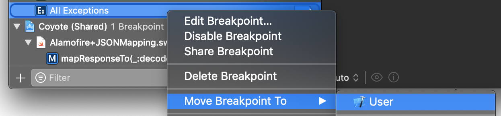
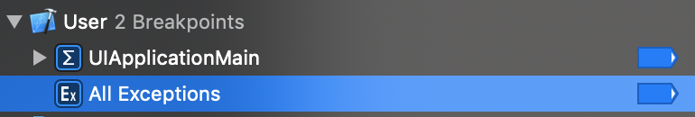

---
 
date: 2019-09-24
category:
  - Xcode
---

# Xcode断点技巧

Xcode断点允许调试并找到bug的解决方案。如果没有断点，代码中到处都是打印语句。

## 什么是断点？
可以将断点放置在某行代码上，并在执行期间暂停应用程序，以检查应用程序的状态。可以在应用程序运行之前和期间随时设置断点。
<br>
可以在断点导航器中显示所有已激活和禁用的断点。调试栏包含断点激活按钮，以临时禁用断点暂停应用程序。


## 1：用户定义的断点
对于每个新Xcode项目，可能要做的少数事情之一是添加那些帮助调试许多bug的方便断点。这个冗余的过程可以通过Xcode中用户定义的断点来解决。

移动断点后，它将显示在包含所有用户定义断点的自身部分中。

这使得断点在打开的每个Xcode项目中都可用。这包括创建的项目以及从互联网下载的项目。

## 2：通过GIT共享断点
有时你意识到同事有一些有用的定义断点。与其问他设置相同断点的说明，你可以让他通过GIT分享。

这会将断点移动到具有共享断点的自己的部分。这使得获得所有共享断点的概览非常容易。

当断点被共享时，保持其active也是共同的责任。因此，如果有同事决定删除断点，一旦从GIT中提取最新更改，它也将从我们的断点列表中删除。

## 3：带有调试器命令操作的异常断点
当抛出或捕获特定类型的异常时，会触发异常断点。每当异常断点命中时，单击onobjcobjc_exception_throw后立即键入po $arg1语句，以获取有关抛出异常的更多信息：

这可以使用断点中定义的操作轻松实现自动化。任何定义的操作都将在断点被击中时执行。

当然，现在将直接使其成为用户定义的断点，这样就不必每次创建新的Xcode项目时都创建这个断点。

## 4：符号断点
在调试控制台中的消息经常会得到帮助，告诉我们创建符号断点。一个与自动布局相关的符号断点：
``` swift
// Will attempt to recover by breaking constraint 
<NSLayoutConstraint:0x600000d7aad0 UIView:0x7fbe55e95420.leading == UILabel:0x7fbe55e95d20.leading + 8   (active)>

// Make a symbolic breakpoint at UIViewAlertForUnsatisfiableConstraints to catch this in the debugger.
```
当调用特定方法或函数时，会触发符号断点。可以从断点导航器添加：


在断点中填写关键字，每当调用该符号时，它将暂停您的应用程序以开始调试。

可以快速导航到激活不满意约束的代码。
但这不是约束错误断点吗？
令人惊讶的是，这些错误并没有触发约束错误断点。根据苹果论坛上的这个线程，这个断点仅适用于AppKit。

## 5：用测试失败断点捕捉失败的测试
当测试失败时通常会开始浏览测试列表以找到失败的测试。虽然这是可行的，但如果在流程中它并不真正有效。为此，我们有测试失败断点，该断点将直接跳转到测试中的失败断言，允许直接开始修复失败的测试。


