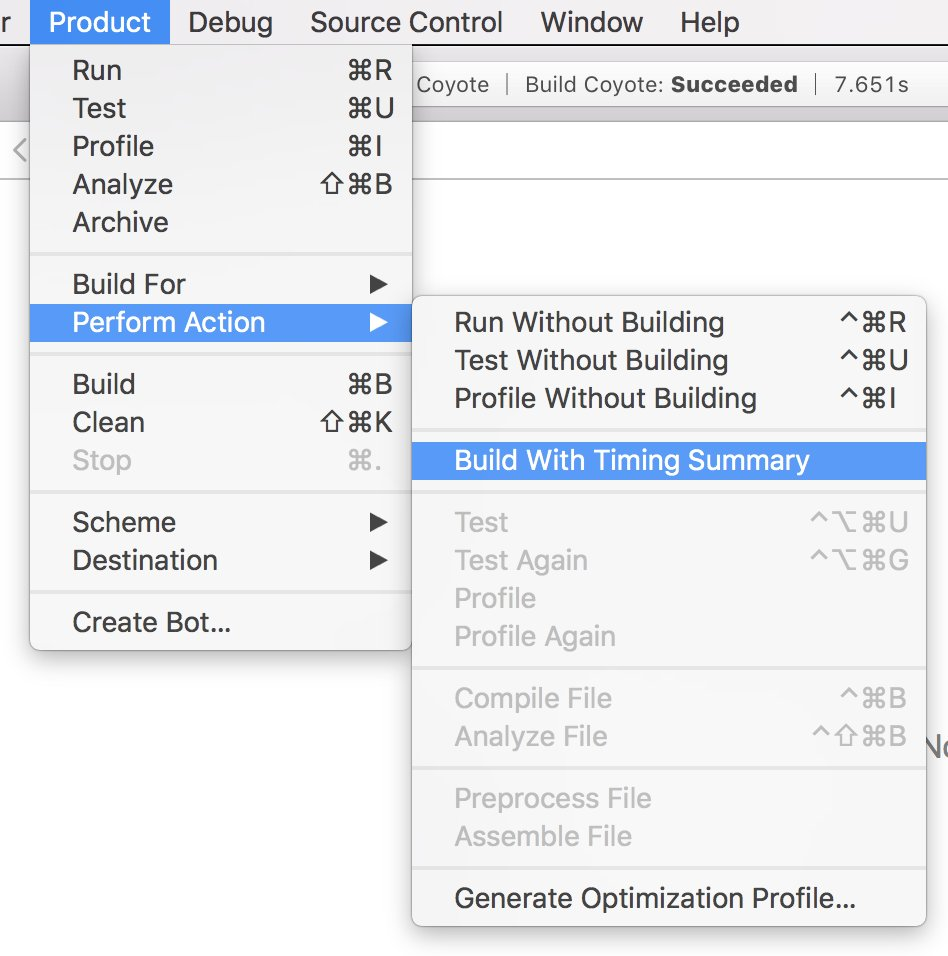
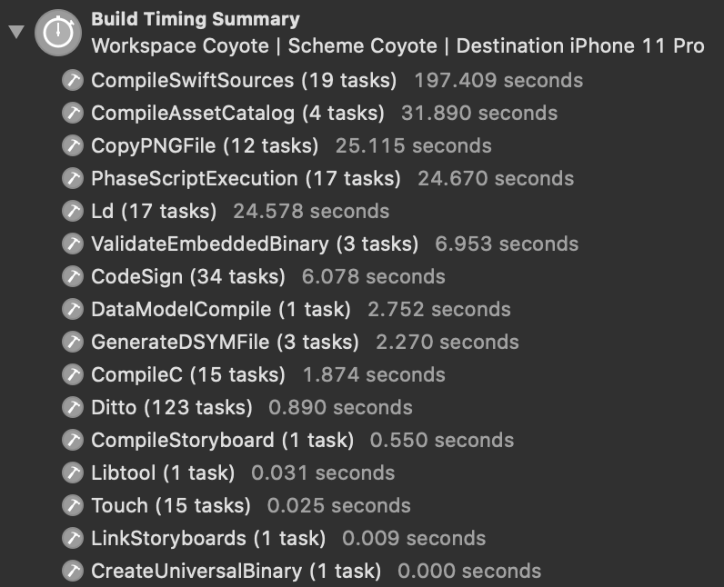
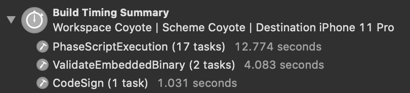
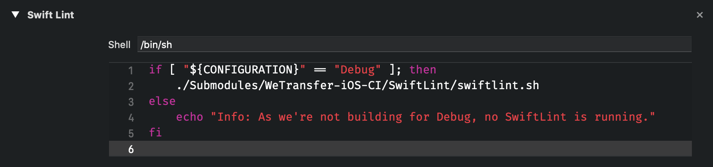
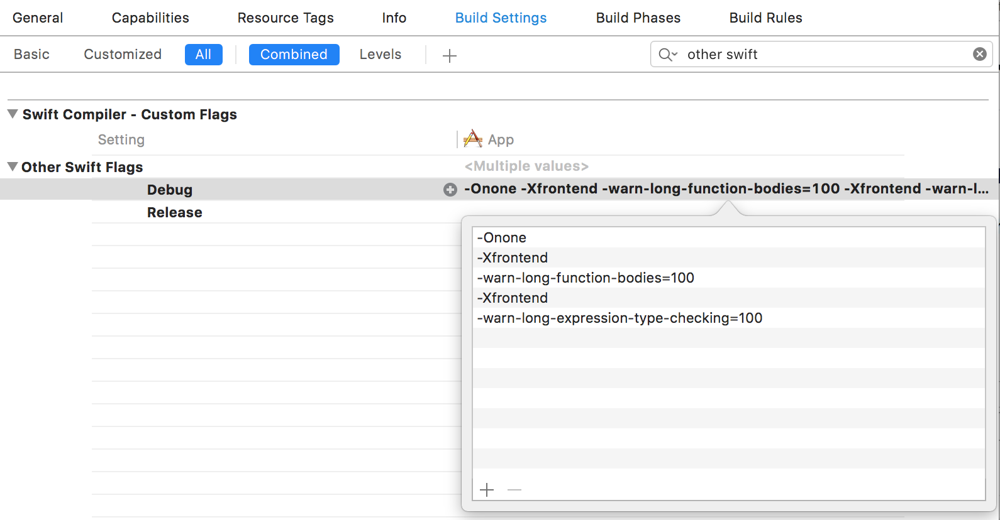
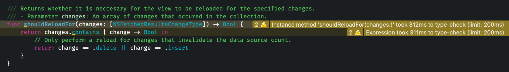
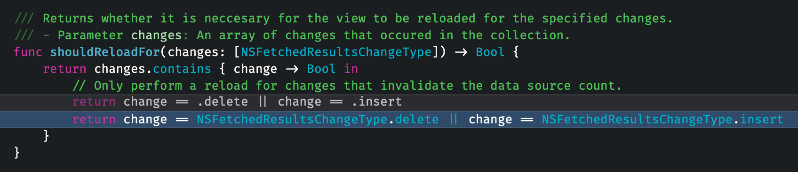
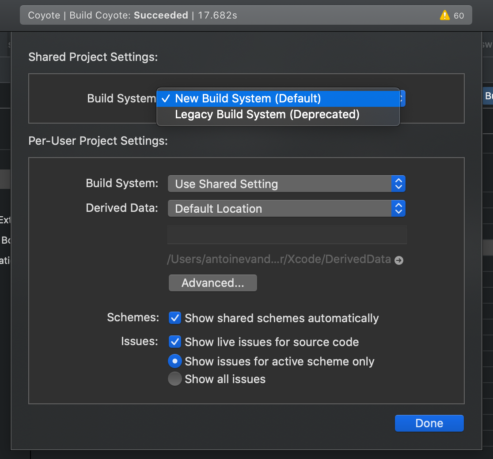
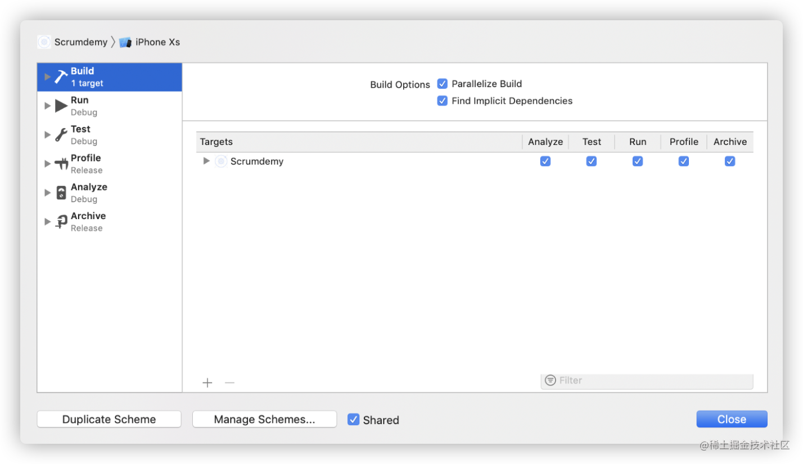

---
 
date: 2020-11-15
category:
  - Xcode
---

# Xcode bulid速度

在Xcode中分析build性能，以加快Xcode build速度。这可以轻松加快工作流程并节省大量时间。

## Build With Timing Summary
Xcode 10引入了带有 Build with Timing summary 功能。build一次项目并生成每个类别所花费的时间概览。
 
>功能入口:
>
>Product ➔ Perform Action ➔ Build with Timing Summary或使用xcodebuild -showBuildTimingSummary

执行操作后可以看到Xcode在目标设备或模拟器上build项目。
build完成后到报告导航器选择最后一次build。选择Recent并一直向下滚动，直到构建时间概览。

这是可以发现哪里可以改进项目。

可以看到，大部分时间都花在CompileSwiftSources、PhaseScriptExecution和资源相关任务上。改善代码的编译时间可能不是那么容易，但可以看看改进build阶段的编译时间。

请注意在这里是做了完整的build，这与做增量build不同。值得再次直接执行该操作，因为这将导致出现不同的构建时间概览，不包括资源生成类别。换或者可以这样认为：该部分不需要被优化，因为我们主要希望专注于提高性能的最大部分，这归结为增量build。

上述例子中没有接触任何代码，而是再次直接运行带有时间概览的build操作。这些是每次做一次更改时需要重新操作的。 Phase Script需要大部分时间，需要看看如何改进这部分。

## 编译源代码持续时间超过总build时间？
优化之前，需要指出的是，译Swift源可能需要比总构建时间更长的时间。上述build花了107秒才成功，而编译Swift源代码则花了197秒。

我向Xcode Build System团队的Rick Ballard进行了澄清，对系统的工作原理给出了一些很好的见解，原因是：
> 许多命令，特别是编译，能够相互并行运行，因此多核机器完成build的速度比运行每个命令所花费的时间快得多。

## 优化build
优化build阶段是加快Xcode build速度的好方法。可能一些build阶段不需要调试并且可以配置为run for release builds only。
 
我发现我们项目的大部分时间都花在执行SwiftLint上。每个增量build需要10秒才能执行。
 
一个小改进是添加了--quiet参数，但每次build只获得了不到一秒。但是所有部分都有帮助。
 
真正大的改进是通过过滤掉没有更改的文件。当许多子模块中运行SwiftLint时，很容易在每个build中获得约15秒的改进，包括所有target。

## 仅在需要时run a build phase 
如果有一个仅用于调试或发布构建的构建脚本，则可以包括下面的配置检查：

这种情况下，我们只为调试构建运行SwiftLint脚本。如果您想仅为发布构建运行脚本可以通过检查“发布”构建来做同样的事情。

## 函数和表达式的类型检查
为了缩小build时间，可以enable swift-flags来获取更多。这些flag在Xcode 10之前就已经可用。

编译器可以使用两个前端标志警告需要很长时间才能键入检查的单个表达式：
<!-- >-Xfrontend -warn-long-function-bodies=<limit>
>
>-Xfrontend -warn-long-expression-type-checking=<limit>
>
><limit>值可以替换为表达式必须用于类型检查才能发出警告的毫秒数。 -->

启用这些警告: 
Build Settings ➔ Swift Compiler - Custom Flags ➔ Other Swift Flags：

使用此设置Xcode会对任何超过100毫秒的类型检查功能触发警告。这可以指出减慢build时间的方法。拆分这些方法以及添加显式类型可能会带来更好的build性能。

上述方法导致类型检查缓慢对build性能不利。这种情况下缓慢的类型检查是由速记枚举情况引起的。通过在.delete和.insert前面添加NSFetchedResultsChangeType可以修复这些警告：

## Build settings 加快build
通过更改一些Xcode build setting来加快Xcode builg速度。这曾是常见的技术可以在增量build中轻松获取到时间。
 
如今，Xcode默认设置了大多数这些设置，因此没有什么可涵盖的。然而，如果是维护一个旧项目，其中这些设置尚未设置或被错误的值覆盖。

### COMPILATION MODE
- Debug: Incremental
- Release: Whole Module

### OPTIMIZATION LEVEL
- Debug: No Optimization [-Onone]
- Release: Optimize for Speed [-O]

### BUILD ACTIVE ARCHITECTURE ONLY
- Debug: Yes
- Release: No

### DEBUG INFORMATION FORMAT (DWARF)
- Debug – Any iOS Simulator SDK: DWARF
- Release – Any iOS SDK : DWARF with DSYM File

项目设置：
进入File ➔ Project Settings 确保使用New Build System：

最后，检查是否parallelize build：

