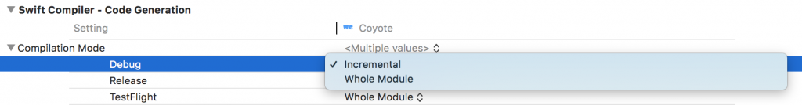

---
 
date: 2018-11-03
category:
  - Xcode
  - iOS
tag:
  - 调试
---

# Xcode快捷操作

## 基本快捷键
Build：	⌘B  
Run：	⌘R  
Test：⌘U  
Stop：⌘.  
Clean：⇧⌘K  
切换导航栏：⌘(1-9)  
前进页：⌃⌘→  
回退页：⌃⌘←  
文件中查找：⌘F  
项目中查找：⇧⌘F  
显示完成：⌃Space  

## run without building
^ ctrl + ⌘ command + R

## 显示document items
Show Document Items：	^6
Goto line：	⌘L

## 跳转到definition
Jump to definition：^⌘Click

## (alt)+助理编辑器
(alt)将Xcode编辑器一分为二，左侧是主要工作文档，右侧是辅助编辑器。
- 在左侧与右侧的界面生成器结合编写代码
- 左边写实现，右边写测试
- 在左侧编写实现，在右侧编写标题（Objective-C）

在Xcode中编程的助理编辑器时，会发现开发速度有所提高。通过采用选项键（通常在键盘上标记为“alt”可以在助理编辑器中轻松加载新文件）
- ⌥ option+单击搜索结果
- ⌥ option+单击快速打开的结果
- ⌥ option+在文件浏览器中单击文件
- ⌥ option+单击操作菜单中的“跳转到定义”

## 范围内编辑所有
使用⌃ ⌃ + ⌘ + E编辑All in Scope，并同时更改所有具有相同名称的变量或方法。

## 快速添加方法注释
使用⌥ ⌥ + ⌘ + /快速添加方法注释

## 代码折叠
Text Editing > Editing下打开首选项，然后选择Code folding ribbon

## 增量build
建议不要使用Whole Module编译模式，而是使用增量来获得更好的结果。这应该在Xcode 10中默认启用。

