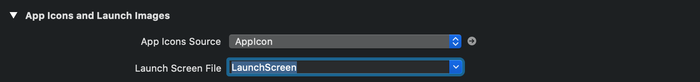
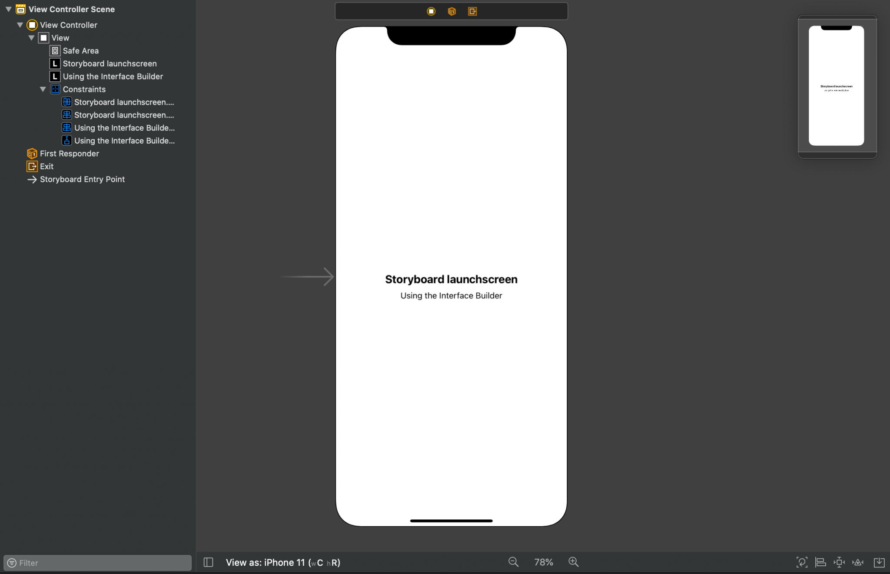
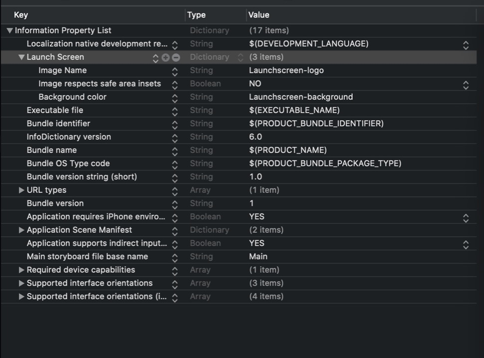
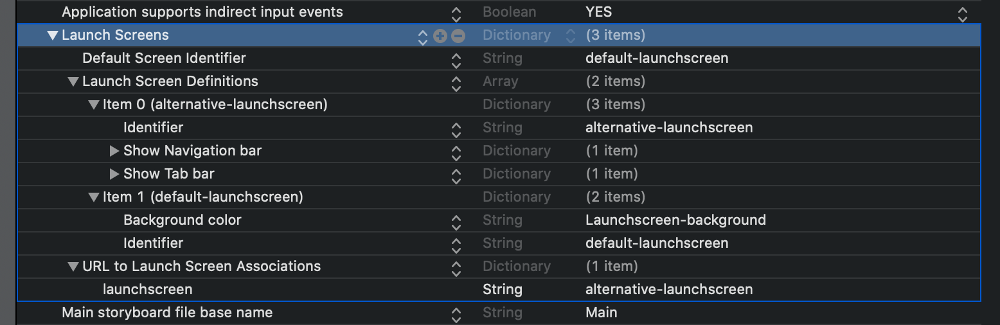

---
 
date: 2021-01-06
category:
  - Xcode
  - iOS
---

# Xcode launch screens

当程序跑起来，Launch screens出现，加载应用程序后，用户可以开始使用应用程序。<br>
Xcode默认提供storyboard可以使用它来设置加载屏幕。<br>
虽然大多数情况下效果很好，但Xcode 12和iOS 14中提供了新选项。

## launch screens 的历史
在Xcode 6之前，我们唯一的选择是在asset目录中提供静态图像。这已经比以前更好了，因为我们曾经为这些图像设置了特定的文件名。<br>

Xcode 6附带的iOS 8允许我们用storyboard替换静态图像。这已经简化并改进了定义加载屏幕的方式，但选项仍然有限。launch screens 被大量缓存，动态替换是不可能的。然而，使用label, imageView和其他界面元素消除了打开图像编辑应用程序以导出所有正确尺寸的图像的要求。<br>

Xcode 12和iOS 14改进了launch screens。

## 如何使用launch screens
在准备launch screens等类似实现时，重新看看苹果的指南总是好的。<br>
在不引用指南中的所有内容的情况下，最重要的是了解一些事情：
> 不建议使用文本，因为本地化不可用
>
> 任何使用过的图像都应该根据不同的屏幕尺寸很好地缩放
>
> 屏幕应尽可能靠近应用程序的第一页

最后一点给出了方向。启动屏幕越接近您的第一页，应用程序的第一印象就越流畅。

## 开发过程中清除缓存
遇到启动屏幕没有更新的情况，iOS会将加载视图缓存为图像以提高性能。因此，需要看看如何清除缓存以确保在弄清楚设置出了什么问题之前看到一个更新的屏幕。

iOS 14上测试期间，大多数情况下，我看到了屏幕的正确更新。然而，如果没有成功的话可以尝试以下任何一项：

- 使用清理build文件夹Product ➞ Clean Build Folder
- 从模拟器中删除该应用程序并重新安装
作为最后的手段可以重置模拟器。然而这很耗时，并不能让你真正高效。

## 睡眠延迟应用程序启动
在开发启动屏幕期间添加延迟可能会很有用，可以更长时间地查看已实现的设计。如果应用程序启动速度快，那么启动屏幕可见的时间可能不到一秒钟。

可以花2秒钟来验证实现：
``` swift
func application(_ application: UIApplication, didFinishLaunchingWithOptions launchOptions: [UIApplication.LaunchOptionsKey: Any]?) -> Bool {
    try! FileManager.default.removeItem(atPath: NSHomeDirectory()+"/Library/SplashBoard")

    do {
        sleep(2)
    }

    return true
}
```

## 实现launch screens的选项
是时候深入了解Xcode 12及更新中的可用选项了。有两种方法可以实现它：
- storyboard（默认）
- plist配置，您可以在其中设置：
  图片、launch image 是否安全区域插入、背景颜色、导航栏可见性、标签栏可见性、工具栏可见性、每个URL scheme的Launch screen configuration
plist配置选项列表在Xcode 12中是新的，允许在不使用故事板的情况下设置启动屏幕。

## storyboard 
这Xcode 6以来的默认可用选项，与使用界面构建器构建视图的方式非常相似。<br>
打开在应用程序的target General中配置的LaunchScreen.storyboard文件：


storyboard，和构建视图一样：


## plist配置
另一种选择是使用plist配置，这很可能是构建启动屏幕的未来最常用方式，因为SwiftUI取代了storyboard。

> 仅当删除了名为“Launch screen interface file base name”或UILaunchStoryboardName时，此配置才会生效。

info.plist 中添加一个UILaunchScreen的key，名为“Launch Screen”：
在此字典中可以设置可用选项的组合。这意味着可以同时设置背景颜色和图像


## 根据 URL scheme配置launch screens 
Xcode 12附带的另一个新方案是可以根据URL scheme配置不同的launch screens。如果应用程序使用自定义URL来链接到你的应用程序，可能会发现按这个方案调整launch screens很有用，以便应用程序可以顺利过渡。

可以配置以下选项：
- 默认Launch screens
- 按URL schem使用的Launch screens

launchscreen:// URL scheme:

key是UILaunchScreens，需要提供默认配置、Launch screen定义和URL关联。<br>
URL关联在字典中定义，键设置为URL方案。像launchscreen://这样的URL方案被定义为launchscreen。该值应与Launch screen定义的标识符匹配。
